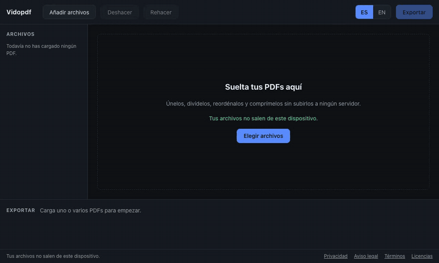

# Vidopdf

[Leer en español](README.es.md) · **[Live demo](https://vidopdf-web.vercel.app)**

A PDF workspace that runs 100% in your browser. Load one or several PDFs, see every page as a thumbnail, and merge, split, reorder, rotate, compress and protect them. **Your files never leave your device**: no backend, no analytics, no third-party requests, enforced by a strict Content Security Policy and an end-to-end test.



> **Status: v1.0.0.** Merge, split (four ways), reorder, rotate, delete, duplicate and extract pages; turn JPEG and PNG pictures into pages and pages into PNG, JPEG or WebP; **compress** the pictures inside a PDF with three presets and see the real size before saving; all with undo and redo, keyboard shortcuts and a Spanish and English interface. Privacy, legal notice, terms and licenses are pages inside the app. What comes next (password protection, forms, signing, offline use) is in [SPEC.md](SPEC.md).

## Keyboard

| Action                        | Shortcut                                 |
| ----------------------------- | ---------------------------------------- |
| Undo, redo                    | Ctrl or Cmd + Z, Ctrl or Cmd + Shift + Z |
| Select all                    | Ctrl or Cmd + A                          |
| Rotate right, left            | R, Shift + R                             |
| Delete pages                  | Delete or Backspace                      |
| Duplicate                     | Ctrl or Cmd + D                          |
| Preview                       | Space or Enter (double click also works) |
| Add files, export             | Ctrl or Cmd + O, Ctrl or Cmd + E         |
| Move the selection            | Alt + arrows, Alt + Home or End          |
| Move around, extend selection | Arrows, Shift + arrows                   |

## Run it

Requires Node 24 (`fnm use`), pnpm 12 and, for the tests, `qpdf`.

```bash
pnpm install
pnpm dev          # http://localhost:5173
pnpm test         # unit, property, PDF integration and architecture-rule tests
pnpm e2e          # Playwright: privacy, accessibility, hostile files (Chromium; e2e:webkit for WebKit)
pnpm build        # production bundle in apps/web/dist
pnpm bench        # performance and memory benchmarks (about 2 minutes)
pnpm lighthouse   # Lighthouse on the built site, fails under 95
```

## How it is built

Ports and adapters: a DOM-free `core`, adapters over `pdfjs-dist` and `@cantoo/pdf-lib`, and a React app whose heavy work runs in Web Workers. The layer rules fail the build when broken ([ADR 003](docs/adr/003-layered-architecture.md)). All decisions are in [docs/adr](docs/adr/README.md).

## Measured

2026-10-09, version 1.0.0, Apple M4 laptop, headless Chromium (and WebKit for the E2E). Reproduce with `pnpm bench`; the full table with every number is in [benchmarks/RESULTS.md](benchmarks/RESULTS.md).

| Metric                                             | Budget (SPEC)                 | Measured                                                                                                          |
| -------------------------------------------------- | ----------------------------- | ----------------------------------------------------------------------------------------------------------------- |
| Scroll of a 1000-page document                     | 60 fps, no task over 50 ms    | 60 fps, no frame over 20 ms, no long task (also with the main thread 4x slower)                                   |
| Reorder, rotate or delete 1 to 1000 pages          | under 100 ms                  | about 31 ms painted (the work itself takes 0.1 to 1.8 ms)                                                         |
| Merge 20 files and 500 pages                       | no blocking, progress visible | 1.5 s, 29 to 33 progress steps, no long task                                                                      |
| First thumbnails of a 1000-page document           | 1 s for 300 pages             | 0.3 to 0.4 s                                                                                                      |
| Memory, 500 text pages / 500 scanned pages (97 MB) | measured and documented       | 0.5 GB / 1.1 GB, peak 1.3 GB exporting ([ADR 015](docs/adr/015-benchmarks-and-memory.md))                         |
| Warning for too much loaded PDF                    | adjusted with data            | 150 MB (was 250 MB)                                                                                               |
| Initial JavaScript                                 | 150 kB gzip                   | 107.3 kB                                                                                                          |
| `packages/core` coverage                           | 90 % lines                    | 99.6 %                                                                                                            |
| Tests                                              |                               | 191 core, 114 adapters, 146 web, 9 architecture rules, 9 benchmark helpers, 85 E2E in each of Chromium and WebKit |
| Lighthouse (desktop, local build)                  | 95 to 100                     | 100 / 100 / 100 / 100 on the workspace and on a legal page ([benchmarks/LIGHTHOUSE.md](benchmarks/LIGHTHOUSE.md)) |
| Compression, median saving on photographic PDFs    | 40 % at "balanced"            | 96 % (synthetic corpus, see below)                                                                                |
| Compress 500 scanned pages (165 MB)                | measured and documented       | 42 % smaller in 18 s, renderer peak 1.8 GB                                                                        |

## Compression, measured

The method and every number are in [ADR 004](docs/adr/004-compression-strategy.md) and [benchmarks/COMPRESSION.md](benchmarks/COMPRESSION.md); rerun with `pnpm --filter @vidopdf/benchmarks measure:compression`. Each picture is shrunk to the resolution the page really draws it at (read from the page's content), then encoded again as a JPEG when that saves at least a tenth. The result is never larger than the input.

| Preset   | Target  | Median saving on photographic PDFs | Worst visible change measured                              |
| -------- | ------- | ---------------------------------- | ---------------------------------------------------------- |
| Screen   | 96 dpi  | 98.8 %                             | 6.5 % of the pixels of a noisy scan differ by more than 24 |
| Balanced | 150 dpi | 96 %                               | 2.9 % (same scan); under 0.1 % on photographs              |
| Print    | 220 dpi | 86.3 %                             | 3.1 % (same scan); about 0.1 % on photographs              |

**What this does not prove.** The corpus has no real photographs: they are drawn from fixed seeds (gradients, blobs, strokes and noise), because no files were downloaded. They behave like photographs under JPEG, but real ones may compress differently. Part of the large saving comes from pictures drawn at 300 to 1300 dpi that are brought down to the preset's resolution; a PDF whose pictures are already at 150 dpi and thin gains nothing at "balanced", and the dialog says so. Text in scanned pages gets softer at "screen" and "balanced"; "print" is the choice for a document that will be read closely.

## Known limitations

- **Compression** only touches JPEG and lossless RGB or grey pictures at 8 bits, without masks or soft masks. It leaves alone CMYK, indexed and calibrated colour, pictures with an alpha channel, line art with few colours (JPEG would blur it), tiny pictures and JPEGs that are already thin. It does not touch fonts or structure, and the new pictures are JPEG: the loss is permanent in the new file (your original is never modified). The picture codec is the browser's canvas, tested in Chromium and WebKit; Firefox is not tested.

- Encrypted PDFs, including those with only owner restrictions, are rejected in this version.
- **Merging uses pdf-lib's `copyPages`, which loses some structure** (pinned by `merge-limits.test.ts`):
  - bookmarks (the outline) are dropped;
  - form fields stop being fillable: the widgets stay visible but the form definition is gone;
  - tagging (`/MarkInfo`, `/StructTreeRoot`) and the document language are dropped, so the output is less accessible to screen readers.
- **Split by bookmarks** uses the bookmarks of the original files, because merging drops them; a page that is the target of a bookmark starts a new file.
- **Split by maximum size** builds the real PDFs to measure them, so it takes seconds on big documents (5.4 s for 500 pages); a page that is over the limit on its own cannot be split and the dialog names it.
- **Pictures in:** only JPEG and PNG (WebP and GIF are turned down). Mirrored EXIF orientations (2, 4, 5, 7) follow the standard table but were not checked against camera files.
- **Pictures out:** WebP depends on the browser (Safari on macOS cannot write it, and the option is switched off with an explanation). Pages too large for the canvas budget are drawn at a lower resolution and you are told. A ZIP is built in memory.
- **Memory:** about 6.5 MB of browser memory per MB of scanned PDF; the application warns at 150 MB loaded.
- External links and the text layer survive. Pictures are copied byte for byte unless you ask for compression.
- **Accessibility** is a target (WCAG 2.2 AA), checked with axe in every screen and by hand with the keyboard, but there has been no external audit, so this is not a claim of conformance.
- **Legal texts** (privacy, legal notice, terms) were written by the developer with Claude Code, not by a lawyer. The project is run under the alias vidotho; see the legal notice in the app.

## How this was made with AI

Vidopdf is built with Claude Code from a written specification ([SPEC.md](SPEC.md)). Claude Code writes code, tests and ADRs one phase at a time; vidotho reviews each plan before it starts, and reviews the result. This section records what was asked, generated, reviewed and corrected, and is updated at the end of each phase.

**Phase 0.** Claude Code set up the monorepo, the layer rules and their proof tests, the CI, the strict CSP and the two spikes (pdf.js in a worker, merging with pdf-lib). Corrections made along the way, found by running things rather than assuming: pdf.js 6 no longer has `isEvalSupported`; pdf.js reads `document` in places that break inside a worker (ADR 009); a native `<select>` makes WebKit log a spurious CSP warning, so the language switch is a button group.

**Phase 1.** Claude Code proposed the plan in six blocks and vidotho approved it, delegating the open choices ("whatever is best for the user and for development"). Each block was a pull request that had to pass CI before merging. Choices Claude made on its own, so they can be reviewed: the workspace as immutable page references edited by commands ([ADR 010](docs/adr/010-workspace-as-a-plan-of-commands.md)); a pure planner for thumbnail renders ([ADR 011](docs/adr/011-thumbnail-pipeline.md)); virtualizing the grid with arithmetic instead of `@tanstack/react-virtual`, and keyboard reordering with Alt + arrows instead of dnd-kit's keyboard sensor ([ADR 012](docs/adr/012-grid-virtualization-and-reordering.md)). Found by running, not by thinking: pdf.js progress callbacks can arrive after the result (a race that left the export stuck), the first draft of the layer rules missed workspace package names, and a comparison tolerance of 0.1 % of pixels was too loose to notice a changed text label, so it is 0.01 %. What was _not_ done: the real-world public-domain PDF samples SPEC mentions; code-generated fixtures stand in for them.

**Phase 2.** Same loop: plan first, approval, then five blocks as pull requests (pure logic in `core`, adapters, workers and state, interface, benchmarks), each merged only with CI green. vidotho delegated the open choices again. Taken by Claude and recorded for review: splitting works on the workspace and not on the files ([ADR 013](docs/adr/013-splitting.md)); pictures become one-page PDF sources on import and are drawn on white paper with the grid's rotation on export ([ADR 014](docs/adr/014-pictures-in-and-out.md)); the memory warning moved from 250 to 150 MB with the measurements as the reason ([ADR 015](docs/adr/015-benchmarks-and-memory.md)). **Found by measuring or by a real browser, not by thinking:** scanned PDFs did not show thumbnails (pdf.js needed a canvas it cannot create in a worker; only a big enough scan triggers it), exporting 500 scanned pages as pictures used 4.8 GB (now 1.4 GB), loading kept extra copies of the file, and the image-format check asked a canvas with no context, so every format looked unsupported and the panel looped. **Not done, or not verified:** the real-world public-domain PDFs of SPEC (code-generated fixtures stand in), memory in Safari and Firefox, and a measurement on a real mid-range laptop (the 4x column is only a proxy).

**Phase 3.** Same loop again (plan, approval, blocks as pull requests, CI green before merging). The first thing built was a spike, because SPEC makes AGPL software (MuPDF) the fallback only if the JavaScript route fails the 40 % bar: it passes by a wide margin ([ADR 004](docs/adr/004-compression-strategy.md)), so the question never had to be asked. Taken by Claude and recorded for review: shrink to the resolution a picture is drawn at, read from the page content (not guessed from its size); never recompress what could be damaged by it (line art, masks, unusual colour); keep object streams off (they saved 0 to 1.5 %). **Found by measuring:** re-encoding without resizing saves only 25 % at "print"; the existing 150 dpi benchmark scan has nothing to gain at "balanced" (a first benchmark run reported 0 % until a 200 dpi scan was added); the browser benchmark needed a second, sharper scan to be meaningful. **Not done, or not verified:** real photographs (the corpus is synthetic), Firefox, a lawyer's review of the legal pages, and the trademark search the SPEC asks for in EUIPO and OEPM (the owner has to do it).

## Privacy and legal

[PRIVACY.md](PRIVACY.md) (English and Spanish). The same texts, plus the legal notice, the terms and the licenses, are inside the app, linked in the footer.

## License

MIT. Third-party notices: [THIRD_PARTY_LICENSES.md](THIRD_PARTY_LICENSES.md), also shown in the app.
